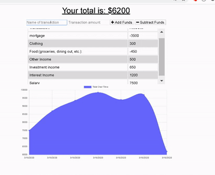

# Budget-Tracker

## Description
The user will be able to add expenses and deposits to their budget with or without a connection. When entering transactions offline, they should populate the total when brought back online.

## Table of Contents
* [Installation](#installation)
* [Technologies-Libraries](#technologies-libraries)
* [Demo](#demo)
* [Credits](#credits)

## Installation
In your terminal type: 
```git clone https://github.com/Amitabh-K/Budget-Tracker```
* Open in Visual Studio to build and run.
* For further instructions, visit https://help.github.com

## Technologies-Libraries
IndexedDB - Express - Mongoose - JavaScript - HTML - CSS 

## Demo


Live link: https://amitabh-budget-tracker.herokuapp.com/

## Credits
[Amitabh Kumar](https://github.com/Amitabh-K)  
[Uoft BootCamp](https://bootcamp.learn.utoronto.ca/coding/?utm_source=pardot&utm_campaign=cln_coding_new_em8&utm_medium=email&utm_term=cta-btn)
